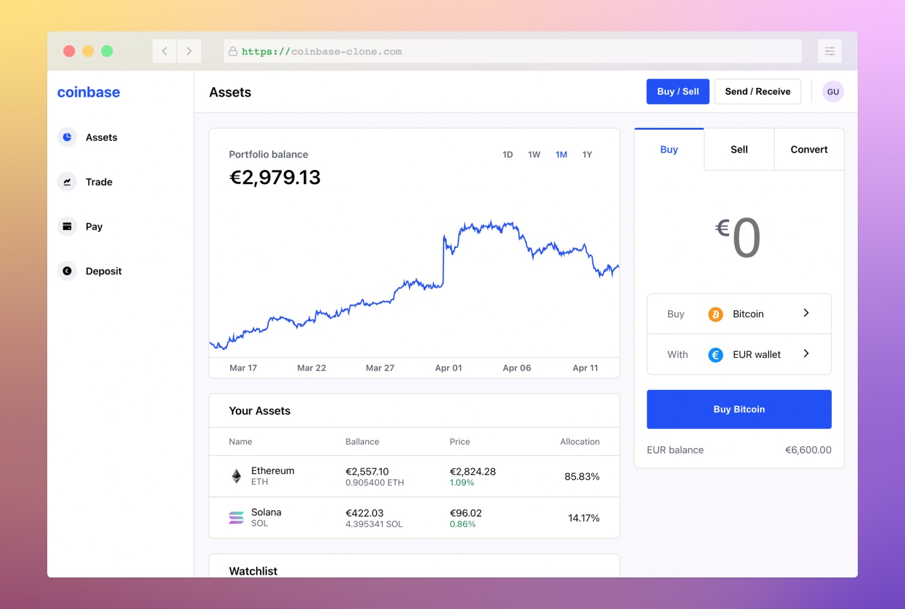

<h1 align="center">Simplified Coinbase Clone</h1>
<h3 align="center">Build with React, JavaScript, and Firebase. Real-time data from Coinranking API.</h3>

[Go to live app](https://coinbase-clone.com/)

## What is this and who is it for ⭐

This is a simplified Coinbase clone built with React, Firebase, and the Coinranking API. The app lets you check prices, price histories, and market cap of popular cryptocurrencies. Furthermore, you can simulate trading crypto assets, sending crypto to friends as well as depositing and withdrawing fiat currencies.

After building a [Todoist Clone as my first React project](https://github.com/maker0101/Todoist_Clone) I was looking for a second React training project where I could:

- Continue to practice building reusable components and hooks.
- Work with external data APIs for data fetching
- Build my first Charts :-)

This project focuses on the Frontend. You are very welcome to have a look at the code.
As this project helped me tremendously on my journey to become an awesome Frontend Developer, I hope it provides some value for you too 🤓.

## Features and Technologies

- Written in **modern React** and **JavaScript**
- **Simple** vanilla React **state management** (without Redux, Recoil, or similar)
- **Coinbase UI** (as of March 2022)
- **Firebase** as backend (for authentication and database)
- Crypto data fetched using [Coinranks awesome API](https://developers.coinranking.com/api) via [RapidAPI](https://rapidapi.com/)
- Charts created with [Chart.js](https://www.chartjs.org/)

## Getting started 🛠

- Signup for a [RapidAPI account](https://rapidapi.com/), set up an app, and Subscribe to the [Coinranking API](https://rapidapi.com/Coinranking/api/coinranking1/)
- Signup for a [Firebase account](https://firebase.google.com/) if you don't have it already, create a new project, then set up a web app.
- Inside Firebase, set up Firestore and create three collections `transactions`, `yourCoins`, `yourFiat`.
- Inside Firebase, setup Firebase authentication and enable Email/Password, Anonymous, and Google SignIn.
- `git clone https://github.com/maker0101/Coinbase_Clone`
- Create an empty `.env.local` file in the root directory, copy `.env.local.example` contents into it, and fill `XXX` placeholders with your RapidAPI and Firebase project credentials.
- `npm install`
- `npm start`
- The app should now be running on `http://localhost:3000/`.

## Shortcomings

I'm aware of the following shortcomings listed below:

### Performance 🚀

- The current app is not performance optimized
- Currently, there is no data caching of responses implemented, resulting in considerable layout shifts

### Security 🔒

- All validations of transactions are currently taking place on the client. For a production app, transaction validations should be implemented in the backend.
- Separating production and development environments is recommended.

### Styling 🎨

- To make the app more maintainable, repeating properties like colors, breakpoints, and sizes should be stored and used as custom CSS properties.
- The current app implementation performs styling mostly via classnames. But in situations where truly dynamic CSS properties are needed, some inline styling is used. While this is working, switching to a unified styling approach (e.g. with 'styled-components') is recommended.
- App uses BEM classname convention to prevent classname collisions. While working, adopting e.g. 'styled-components' would eliminate the need for BEM, because of automatic unique class name generation

### Data management 🗄

- Currently, all users share the same data. This is a major shortcoming and I will work on fixing it soon.

### Accessibility ♿

No extra efforts have been put into making this project more accessible. For a production-ready app, adding aria roles and keyboard support would go a long way toward making the app more accessible.

### Testing 🧪

- Testing is currently missing. This is a major shortcoming and I will work on fixing it soon.

## Author: Max Breitsprecher

- Website: [maxbreitsprecher.com](https://www.maxbreitsprecher.com/)
- Email: max.breitsp@gmail.com
- Github profile: [github.com/maker0101](https://github.com/maker0101)

If you have any questions or feedback, feel free to say hi. 👋

## License

[MIT](https://opensource.org/licenses/MIT)

## Shout out

- This great [YouTube video from JavaScript Mastery](https://youtu.be/9DDX3US3kss) helped me discover the Coinranking API and the Rapid API service.
- Again, I would like to thank my awesome code tutor [Esen](https://github.com/snqb) for his invaluable feedback, code reviews, and words of encouragement.

## Disclaimer

This project is entirely for educational purposes. It is in no way connected to Coinbase, the app or Coinbase, the company. I'm just a fan of their app and figured it would be a fun, educational challenge to recreate a simplified web-app version of it.
